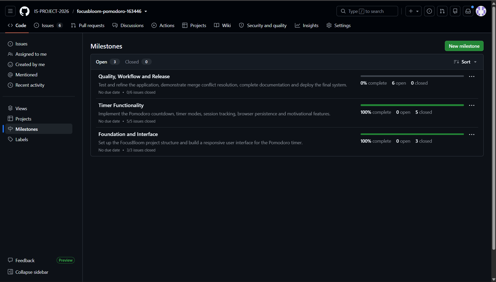
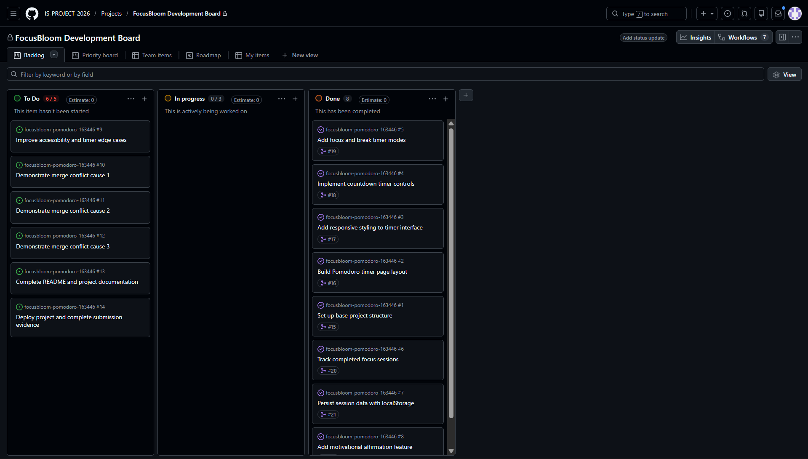
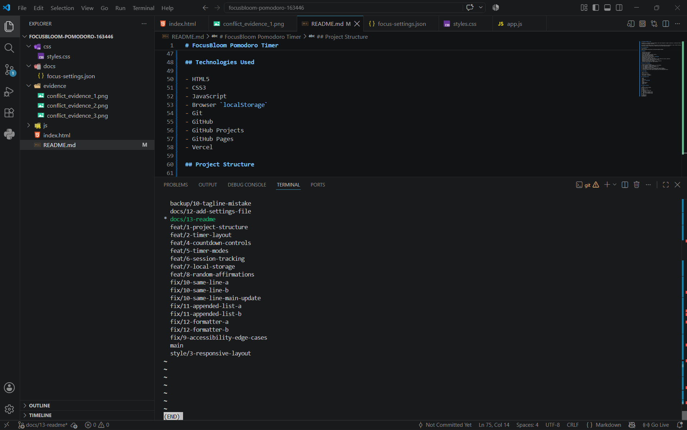
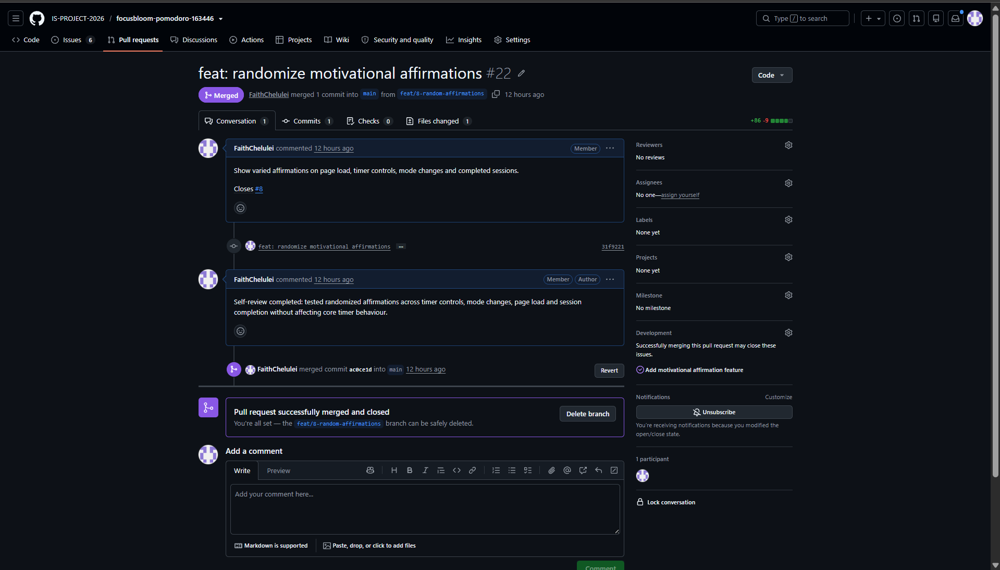
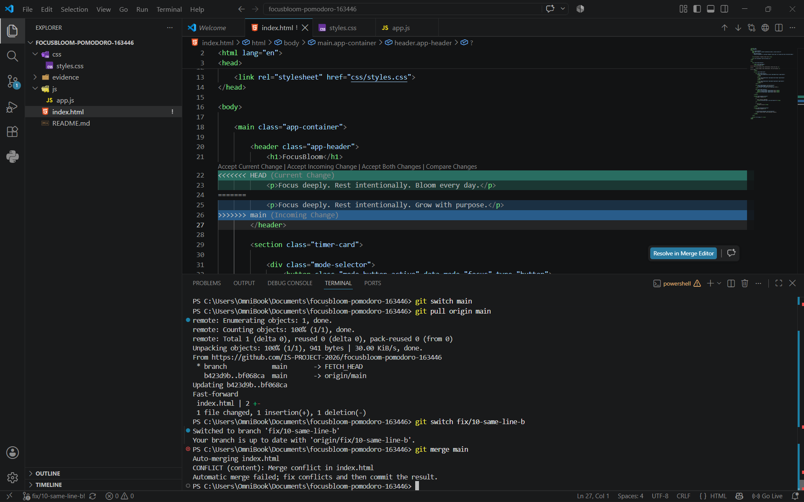
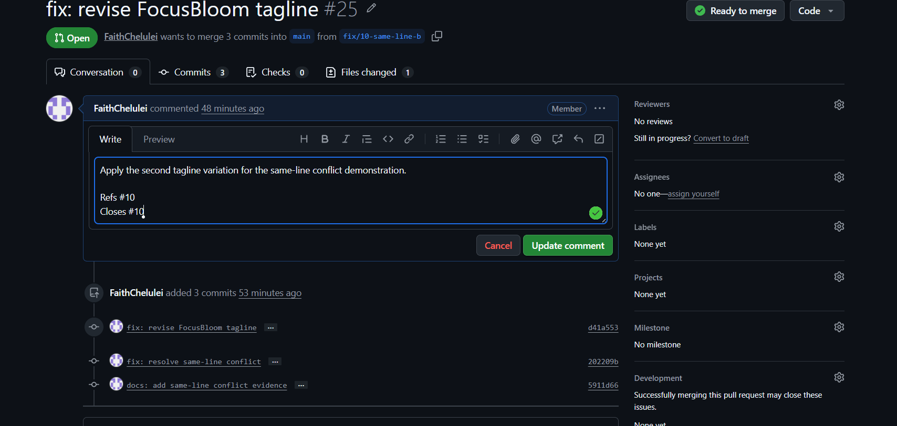
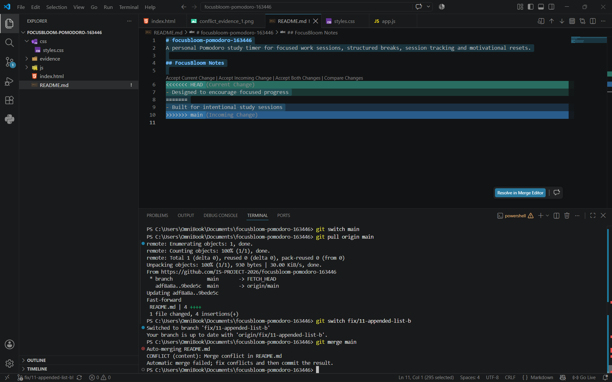
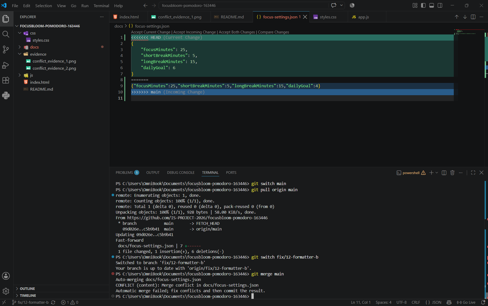

# Project Submission Report

## 1. Student Details

- **Full Name:** Chelulei Faith Cherop
- **GitHub Username:** FaithChelulei
- **Email:** [faith.chelulei@strathmore.edu](mailto:faith.chelulei@strathmore.edu)

---

## 2. Deployed Project Link

- **Live GitHub Pages URL:** [https://is-project-2026.github.io/focusbloom-pomodoro-163446/](https://is-project-2026.github.io/focusbloom-pomodoro-163446/)

---

## 3. Reflection — Grounded in My Git History

### A. My Best Commit

**Commit URL:**  
[https://github.com/IS-PROJECT-2026/focusbloom-pomodoro-163446/commit/31f922193c0c4f96836ef3d1b062e8c1ae84c990](https://github.com/IS-PROJECT-2026/focusbloom-pomodoro-163446/commit/31f922193c0c4f96836ef3d1b062e8c1ae84c990)

**Why this one?**  
I chose this commit because it clearly follows Conventional Commits using the `feat:` type, has a concise imperative subject, explains the implemented behaviour in its body, and includes `Closes #8` for direct issue traceability.

### B. A Mistake or Struggle

**Link to the evidence:**  
[https://github.com/IS-PROJECT-2026/focusbloom-pomodoro-163446/pull/25](https://github.com/IS-PROJECT-2026/focusbloom-pomodoro-163446/pull/25)

**What happened and how did I recover?**  
While demonstrating the Same Line Edits conflict, the competing tagline changes could not be merged automatically because both branches modified the same line. I inspected the raw conflict markers, selected the intended final tagline, staged and committed the resolution, added the required conflict evidence, and then successfully merged the resolved branch.

### C. A Pull Request I'm Proud Of

**PR URL:**  
[https://github.com/IS-PROJECT-2026/focusbloom-pomodoro-163446/pull/22](https://github.com/IS-PROJECT-2026/focusbloom-pomodoro-163446/pull/22)

**What did I check before merging?**  
I reviewed the JavaScript changes to confirm that randomized affirmations worked on page load, timer controls, mode changes, and completed sessions without breaking the existing timer functionality. I also recorded a self-review comment before merging.

### D. One Thing I Would Do Differently

**What would I change?**  
I would plan the merge-conflict branch sequence more carefully by creating all competing branches from the same clean `main` state before making or merging either change. I would also verify the active branch before every conflict edit to reduce unnecessary rework.

**Link to the evidence of the original decision:**  
[https://github.com/IS-PROJECT-2026/focusbloom-pomodoro-163446/pull/25](https://github.com/IS-PROJECT-2026/focusbloom-pomodoro-163446/pull/25)

---

## 4. Screenshots of Key GitHub Features

### A. Milestones and Issues

**Caption:**  
I organized my project into three development milestones, with granular issues linked to the appropriate development phase before implementation.

### B. Project Board

**Caption:**  
I used the FocusBloom Kanban board to track task progression through To Do, In Progress, and Done as development advanced.

### C. Branching Architecture

**Caption:**  
I used issue-linked branch naming conventions with prefixes such as `feat/`, `fix/`, `style/`, and `docs/` to isolate different pieces of work.

### D. Pull Requests & Traceability

**Caption:**  
I used PR #22 to merge `feat/8-random-affirmations` into `main`. The PR referenced and closed Issue #8 and included my self-review before the merge.

---

## 5. Merge Conflict Evidence

### Conflict 1 — Full Chronology

**What cause did I use?**  
Same Line Edits

#### Step 1: Generating the Clash

**Caption:**  
I created different edits to the same FocusBloom tagline line in `index.html` on the `fix/10-same-line-b` branch and `main`. When I ran the merge, Git reported a content conflict and stopped the automatic merge.

#### Step 2: Inside the Code Editor (Conflict Markers)

**Caption:**  
I saw the raw `<<<<<<< HEAD`, `=======`, and `>>>>>>> main` markers because both branches had changed the same original tagline line differently. I resolved the dispute by retaining the intended `Grow with purpose` tagline.

#### Step 3: Resolution & Clean Merge

**Caption:**  
After resolving and committing the conflict, PR #25 was clean and ready to merge. I added the required evidence and completed the merge into `main`.

---

### Conflict 2 — Different Cause

**What cause did I use?**  
The Appended List

**Why does this cause trigger a conflict?**  
I created this conflict by independently appending different content from two branches to the same list area at the end of `README.md`. Because both changes competed for the same end-of-file region, Git could not automatically determine how the final list should be arranged.

**Caption:**  
I created two competing additions to the FocusBloom Notes list in `README.md`. I resolved the conflict by preserving both useful list items in the final version.

---

### Conflict 3 — Different Cause

**What cause did I use?**  
Line Endings & Formatters

**Why does this cause trigger a conflict?**  
I reformatted the entire `focus-settings.json` file into a compact one-line format on one branch while modifying the `dailyGoal` value in the original multi-line version on another branch. The broad formatting rewrite overlapped with the content change, preventing Git from merging the versions automatically.

**Caption:**  
I created a conflict between the formatted one-line settings version and the multi-line version containing the updated daily goal. I resolved it by keeping readable formatting and preserving the updated `dailyGoal` value of 6.

---

